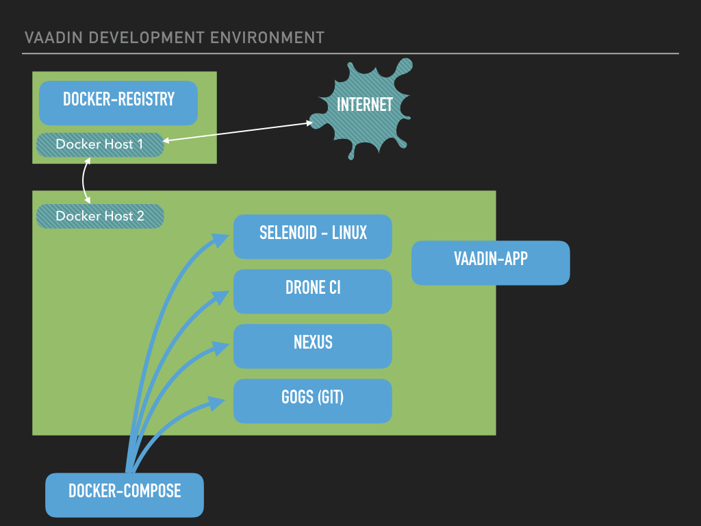
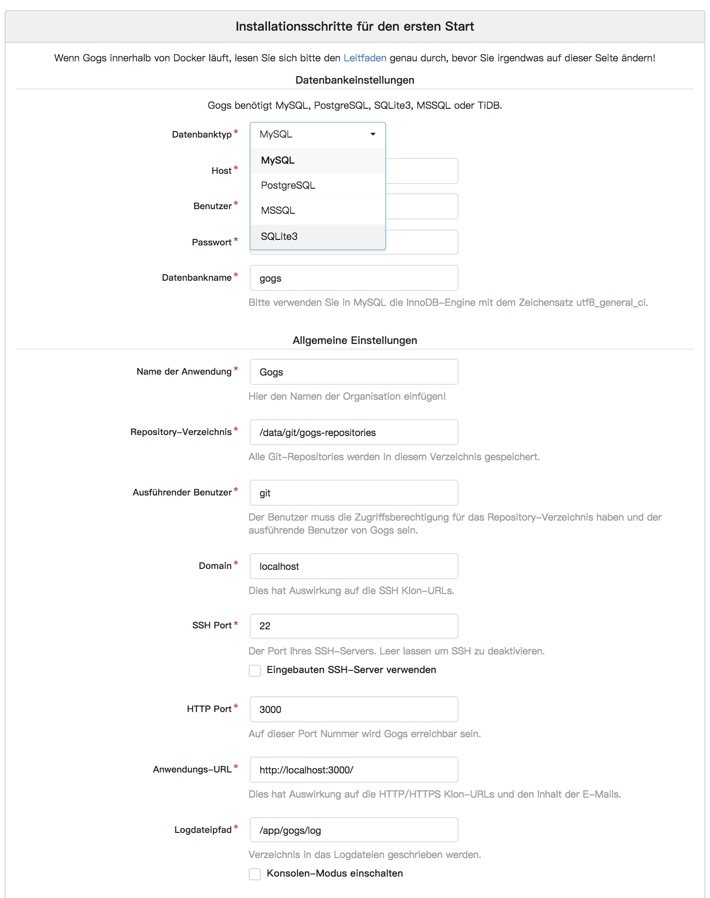
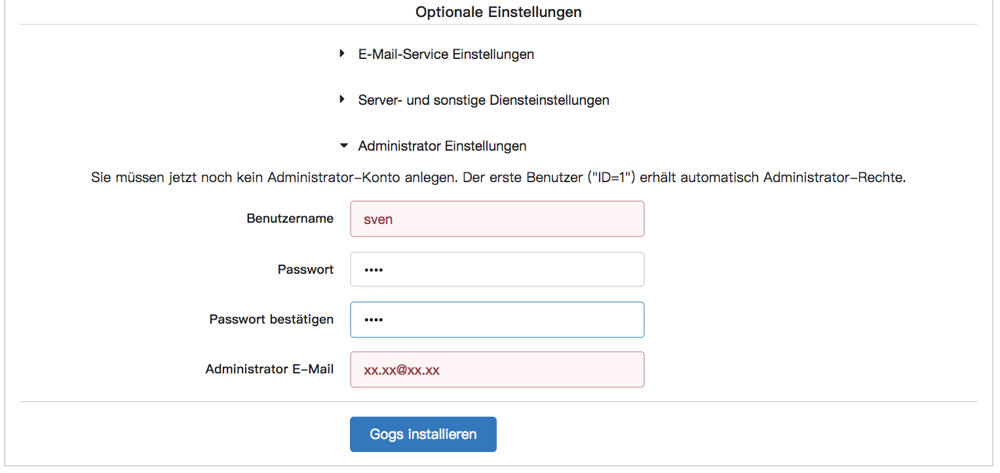

<center>
<a href="https://vaadin.com">
 </a>
</center>

# Vaadin Developer Environment
Welcome to the Development Environment for Vaadin.
With this stack you can ramp up an CI environment in less a hour.
Based on docker-compose we will manage the infrastructure that can be used by a team
for the development of java based web apps.

>This project is not an official Vaadin product, but optimized for 
Vaadin projects.

## Bird Eye View
First we will hav a bird eye view on this environment. The main process is the following.
After you write some code on your machine, you want to test it.
The active UNIT-tests are running in a locale browser until you are done with the first coding step.
Now it is time to test this with all UNIT-Tests. But you don´´ want to wait so long, because the browser that is used 
by the tests are stealing permanently the focus of your mouse/keyboard and so on.

Now you could push your changes to the git-server. This could be github, or the 
gitea instance that is managed by this docker-compose stack. 
Now we assume that you are using the own gitea instance. The DroneCI is connected 
to this git repository (automatically via WebHook) and will start working. 
The defined pipeline will clone the repo, build and test the app. 
If configured, the result will be published. This could be, for example, the locale Nexus.

For the UI Tests, the internal selenoid is used per default. 





## Components
The components so far are:
 * Portainer    [http://localhost:9090](http://localhost:9090) create new user
 * Nexus:       [http://localhost:8081](http://localhost:8081) default: admin/admin123
 * Gitea:       [http://localhost:3300](http://localhost:3300) what you defined
 * DroneCI:     [http://localhost:8000](http://localhost:8000) user account from gitea
 * Selenoid UI: [http://localhost:8088](http://localhost:8080) no account
 * stagemonitor (optional)
    * grafana
    * kibana
    * elastic

### Docker
You have to install Docker on all machines you want to be involved in this 
environment. Here I will describe a scenario that is based on two machines.
If you don´t want to use a Docker Registry as a cache, all is running on one machine.

* machine 1
    * name : docker host 1
    * ip : 192.168.0.100
    * OS: MAC OS
* machine 2
    * name : docker host 2
    * ip : 192.168.0.228
    * OS: MAC OS

Both machines are a Mac Book Pro, with 16GB RAM. Less hardware should fit, 
depending on the workload you are expecting. 
This is my personal, mobile developer and workshop environment.

On both machines the Docker-Network is configured as **192.168.65.0**

### SOCAT Image
I am using (**insecure mode**) the SOCAT Docker Image to access 
the remote machine were the Docker Host is running on.
To get this you only need the docker command 

````docker
docker run -v /var/run/docker.sock:/var/run/docker.sock \
 -d --restart=always --privileged -p 2375:2375 \
 --name docker-sock-proxy docksal/socat
````

Now the docker host is accessible under the external docker host IP.
In my case it is **192.168.0.100**. The same could be done inside a 
docker-compose script, to minimize the manual work.

````dockerfile
services:
  docker-sock-proxy:
    container_name: docker-sock-proxy
    hostname: docker-sock-proxy
    image: docksal/socat
    ports:
      - 2375:2375
    volumes:
      - /var/run/docker.sock:/var/run/docker.sock
    restart: always
    privileged: true
````

### Portainer - The Docker UI
With Portainer, you will get a nice and clear UI to manage your Docker environment.
During the first login , you will be able to define the admin user.
Here in my example I am using username: **admin** with the super-secure password **12345678**

Portainer will give you a lot of information about the docker - host, the images, containers and so on.
Sure, you can get all information's via terminal, but Portainer is just nicer ;-)

### Docker Registry
The Docker Registry is used as a local Docker-Image cache. This should be on 
a Docker Host that is not the same as the developer Docker Host. Here you can decide 
if you want to cache the images only during the runtime of this container or 
on an external volume outside of the Docker Container.
So far, I prefer to use it in a non - persistent way to make sure that 
the Docker Registry could be regularly cleaned.

To start the Docker Registry you can copy the files from the folder **docker-registry**
to the host you want to use as the Registry. On this machine you only have to run a **docker-compose up**.

The Docker Host for the developer environment must be configured to use this Docker Registry as a cache.
If you are using a Mac you could do this by filling out the field for the 
Mirror. 


Make sure that you are using the external IP from the Docker Host.
In my case it is a **192.168.0.100:5500**

### DNS
With the DNS-Proxy you will get a service, that will add
dynamically all containers into the DNS.
So, resolving container-names will be easier.
But this is still **experimental** in this stack.
So, it could be removed again. 


### Nexus
For every build inside a fresh Docker Container, you will need the 
dependencies to build your project. For example, if you are using 
maven, this will lead to a long list of jar-Files that are loaded
from maven - central and other repositories.
To increase speed, I recommend to use a 
local available cache, that can be used for all Docker Containers, as
well as for other Developer machines.

Here I will show you, how you can use this in combination with 
drone.io. But first: How to start your registry, that will 
be your proxy/mirror of the maven central? ;-) 

Inside the docker-compose file there is the section
called: **nexus-server**

```dockerfile
  nexus-server:
    container_name: nexus-server
    hostname: nexus-server
    image: sonatype/nexus3:latest
    ports:
      - 8081:8081
      - 8082:8082
      - 8083:8083
    restart: always
```

Additionally the consumer of this repo needs a section called
**mirrors** inside his used ***settings.xml***.

```xml
    <mirror>
      <id>central</id>
      <name>central</name>
      <url>http://nexus-server:8081/repository/maven-public/</url>
      <mirrorOf>*</mirrorOf>
    </mirror>
```

The URL here, is based on the NameService resolution that can be used from docker-compose.
Until now, the storage of the repository manager (nexus) is transient between restarts.

### Gitea - the local github
With Gitea (or Gogs) there is a local git - Server, that will be used for the 
development process. The CI-Services are using this as reference.
If wanted, github or bitbucket could be used as well. The main target here
is the 100 percent local managed solution, to be independent 
as much as possible from the outer internet. 

The git server needs some configuration.
After the first start, you have to go to the address DOCKER_HOST_IP:3000.
You will get a first config screen. Select as database **SQLite3** and scroll down the page. 




At the bottom you will have to fill out the details for the admin user you want to start with.
The username **admin** is reserved and could not be chosen.



Now you have the possibility to clone git repos into this Gitea instance.
All repositories you want to use together with the CI should be here.

### DroneCI
There are so many CI-Tools available, and most of them are bigger as you need.
But, for a lot of projects you can use the simple DroneCI.
DroneCI is split up in three parts. Number one is the CI-Server, 
that manages all CI-Agents and will be connected from the CI-CLI.
In this example we are not using Kubernetes or Docker Swarm. So all CI-Agents are 
running at the same physical machine.

````dockerfile
  drone-server:
    container_name: drone-server
    hostname: drone-server
    image: drone/drone:0.8
    ports:
      - 8000:8000
      - 9000:9000
    volumes:
      - ./droneio/drone:/var/lib/drone/
    restart: always
    depends_on:
      - nexus-server
      - git-server
    links:
      - nexus-server
      - git-server
    environment:
      - DRONE_HOST=http://${DRONE_DOCKER_EXTERNAL_IP}:8000
      - DRONE_OPEN=true
      - DRONE_SECRET=ok
      - DRONE_PLUGIN_PULL=true
      - DRONE_CACHE_TTY=1m
      - DRONE_DATABASE_DRIVER=sqlite3
      - DRONE_GOGS=true
      - DRONE_GOGS_URL=http://git-server:3000
      - DRONE_GOGS_SKIP_VERIFY=false
      - DRONE_GOGS_PRIVATE_MODE=true
````

Part number two is the group of CI-Agents. The are responsible to manage the 
build itself. This means, to create the Docker Container that is used to proceed the defined pipeline.
You can define as much Agents as you need, even on other machines.
The important thing is the IP to reach the Drone-Server and the secret.

````dockerfile
  drone-agent:
    image: drone/agent:0.8
    restart: always
    depends_on:
      - drone-server
    links:
      - nexus-server
    volumes:
      - /var/run/docker.sock:/var/run/docker.sock
    environment:
      - DRONE_SERVER=drone-server:9000
      - DRONE_SECRET=ok
````

Part number three is the CI-CLI. Here you can get a few information's about the status of this system
and builds can be trigged again and so on.

````dockerfile
  drone-cli:
    build: droneio-cli/
    container_name: drone-cli
    hostname: drone-cli
    restart: always
    depends_on:
      - drone-server
    links:
      - drone-server
    environment:
      - DRONE_SERVER=http://drone-server:8000
      - DRONE_TOKEN=${DRONE_DOCKER_SEC_TOKEN}
    stdin_open: true
    tty: true
````

There is only thing that we have to define after the first start of the DroneCI Server is the Security Token.
This should be pasted into the **.env** file. The Token could be found at:
**Menue -> Token -> Example CLI Usage**

### Selenoid
Selenoid is a replacement for the traditional Selenium Implementation. It is written in Go
and available as Docker Image as well as Selenium. In Comparison to Selenium, the 
supported Browsers are Firefox, Google Chrome and Opera. Additionally, the management of the 
Browser Images are very easy if you are using the manager image that is available to create the config file
for the active browsers for the current cluster. **browsers.json**

#### create the browsers.json
The JSON file **browsers.json** will configure the active and available browser types and versions
for this cluster. To create a version you can use the following two commands.
The first will get the images with VNC support, and the second one without vnc support.

````bash
docker run --rm \
-v /var/run/docker.sock:/var/run/docker.sock \
-v `pwd`/selenoid/:/root/.aerokube/selenoid/ \
aerokube/cm:latest \
selenoid configure \
--tmpfs 128 \
--browsers chrome,firefox,opera \
--last-versions 4 --vnc
````
````bash
docker run --rm \
-v /var/run/docker.sock:/var/run/docker.sock \
-v `pwd`/selenoid/:/root/.aerokube/selenoid/ \
aerokube/cm:latest \
selenoid configure \
--tmpfs 128 \
--browsers chrome,firefox,opera \
--last-versions 4
````


This command will start downloading the latest four available versions 
of the declared browsers. The corresponding config file **browsers.json** 
will be written to the mounted folder **selenoid**

To reconfigure the **browsers.json**, delete the file in the folder
**selenoid/** and re-create the selenoid based images/containers.
using docker-compose.

This could be done on regular base, triggered by chron-jobs.

#### videos
The folder **selenoid/video** is mounted inside the Docker Container
that is used for the Selenoid Hub.


## Limitations so far
I am not finally done with this stack. There is a lot of possibilities to improve
the whole thing.
So feel free to create Merge/Pull Requests to help to make this **round**.

### Help needed
If you are a Docker Guru, please help me with this DNS 
related tasks. How to resolve logical container names
between networks.... ? 

### To many places to edit an IP
If you are working with a Desktop, or inside a static network, you are fine 
editing the IP´´ once.
But if you are using this on a laptop, and changing networks often, you will be 
bored at some point.

#### Drone Clone Plugin
There is a BUG at the drone subsystem right now, means, the clone stage is not properly 
using the DNS. The result is, that you have to use the static IP of 
your Docker-Host as git-server IP. You can edit this 
at the app.ini inside the git-server container, or during the 
first initial web request to configure the git-server.

But If you are using a git-server with an valid static IP, all will be fine.
Here I am using the external IP from the Docker-Host.

#### settings.xml for the build
If you want to speed up the build itself, you need a maven mirror
that is used for all agents. For this I added Nexus to this stack.
Now, we have the challenge to add to every build config (**drone.yml**) a valid **settings.xml**.

The file itself is not so difficult.

```xml
<?xml version="1.0" encoding="UTF-8"?>
<settings xmlns="http://maven.apache.org/SETTINGS/1.1.0"
          xmlns:xsi="http://www.w3.org/2001/XMLSchema-instance"
          xsi:schemaLocation="http://maven.apache.org/SETTINGS/1.1.0 http://maven.apache.org/xsd/settings-1.1.0.xsd">
  <mirrors>
    <mirror>
      <id>central</id>
      <name>central</name>
      <url>http://nexus-server:8081/repository/maven-public/</url>
      <mirrorOf>*</mirrorOf>
    </mirror>
  </mirrors>
</settings>
```

There is only this DNS Bug again. The Docker container that is using this, will be inside a new network.
So, logical names are not resolved. Here again we have to use the static IP
of the hosting Docker-Host. 

#### Selenoid Server
And again the Docker-Host IP is needed. To use the Selenoid Server for the UI testing,
the remote driver will need this external IP to connect. 
If you are using the Vaadin Addons, you can provide this with the external config files.

## Roadmap

### S3 Storage - Minio cluster

### nginx proxy

### stagemonitor
Stagemonitor is an Open Source APM Solution.
This is managed by docker-compose as well and will be integrated.


