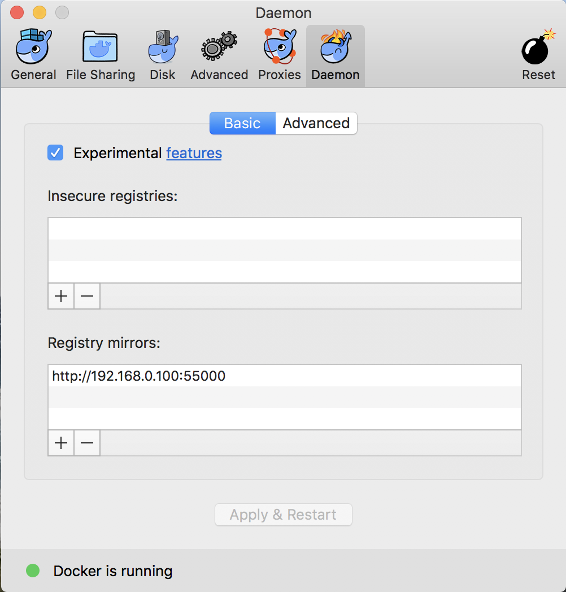

<center>
<a href="https://vaadin.com">
 </a>
</center>

# Vaadin Developer Environment

The target of this project is a Vaadin Developer Environment,
based on docker-compose.


## Components
The components so far are:
 * Nexus:       [http://localhost:8081](http://localhost:8081) admin/admin123
 * Gogs:        [http://localhost:3000](http://localhost:3000) what you defined
 * DroneCI:     [http://localhost:8000](http://localhost:8000) user account from gogs
 * Selenoid UI: [http://localhost:8088](http://localhost:8080) no account

### Docker
You have to install Docker on all machines you want to be involved in this 
environment. Here I will describe a scenario that is based on two machines.

* machine 1
    * name : docker host 1
    * ip : 192.168.0.100
    * OS: MAC OS
* machine 2
    * name : docker host 2
    * ip : 192.168.0.228
    * OS: MAC OS

Both machines are a Mac Book Pro, with 16GB RAM. Less hardware should fit, 
depending on the workload you are expecting. 
This is my personal, mobile developer and workshop environment.


### SOCAT Image
**TODO**

### Portainer - The Docker UI
**TODO**


### Docker Registry
The Docker Registry is used as a local Docker-Image cache. This should be on 
a Docker Host that is not the same as the developer Docker Host. Here you can decide 
if you want to cache the images only during the runtime of this container or 
on an external volume outside of the Docker Container.
So far, I prefer to use it in a non - persistent way to make sure that 
the Docker Registry could be regularly cleaned.

To start the Docker Registry you can copy the files from the folder **docker-registry**
to the host you want to use as the Registry. On this machine you only have to run a **docker-compose up**.

The Docker Host for the developer environment must be configured to use this Docker Registry as a cache.
If you are using a Mac you could do this by filling out the field for the 
Mirror. 



Make sure that you are using the external IP from the Docker Host.
In my case it is a **192.168.0.100:5500**

### Nexus
For every build inside a fresh Docker Container, you will need the 
dependencies to build your project. For example, if you are using 
maven, this will lead to a long list of jar-Files that are loaded
from maven - central and other repositories.
To increase speed, I recommend to use a 
locsl available cache, that can be used for all Docker Containers, as
well as for other Developer machines.

Here I will show you, how you can use this in combination with 
drone.io. But first: How to start your registry, that will 
be your proxy/mirror of the maven central? ;-) 

Inside the docker-compose file there is the section
called: **nexus-server**

```dockerfile
  nexus-server:
    container_name: nexus-server
    hostname: nexus-server
    image: sonatype/nexus3:latest
    ports:
      - 8081:8081
      - 8082:8082
      - 8083:8083
    restart: always
```

Additionally the consumer of this repo needs a section called
**mirrors** inside the ***settings.xml***.

```xml
    <mirror>
      <id>central</id>
      <name>central</name>
      <url>http://nexus-server:8081/repository/maven-public/</url>
      <mirrorOf>*</mirrorOf>
    </mirror>
```

The URL here, is based on the NameService resolution that can be used from docker-compose.
Until now, the storage of the repository manager nexus is transient between restarts.

### GOGS - the local github
With Gogs there is a local git - Server, that will be used for the 
development process. The CI-Services are using this as reference.
If wanted, github or bitbucket could be used as well. The main target here
is the 100 percent local managed solution, to be independent 
as much as possible from the outer internet. 

The git server needs some configuration.
After the first start , you have to go to the address DOCKER_HOST_IP:3000.
You will get a first config screen. Select as database **SQLite3** and scroll down the page. 


At the bottom you will have to fill out the details for the admin user you want to start with.
The username **admin** is reserved and could not be chosen.


